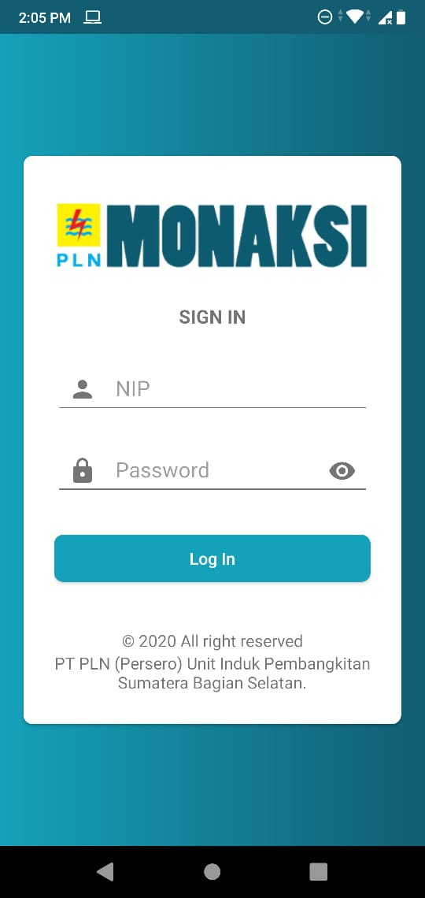
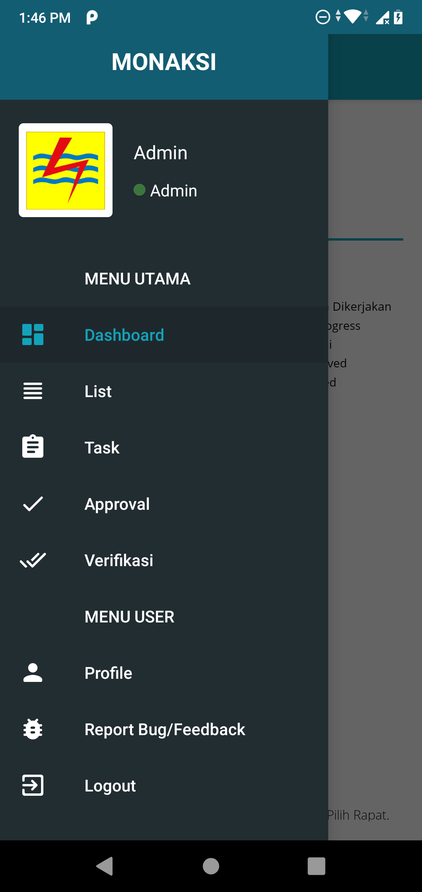
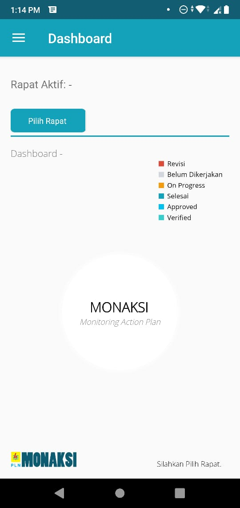
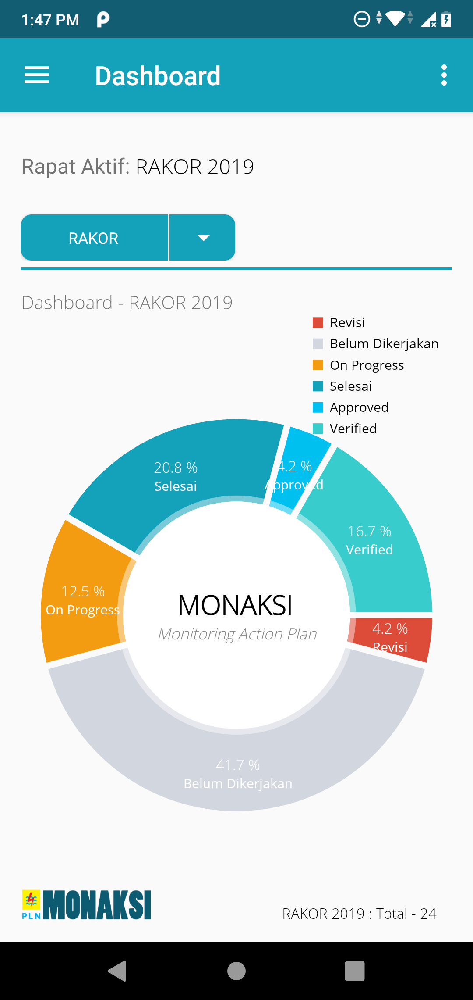
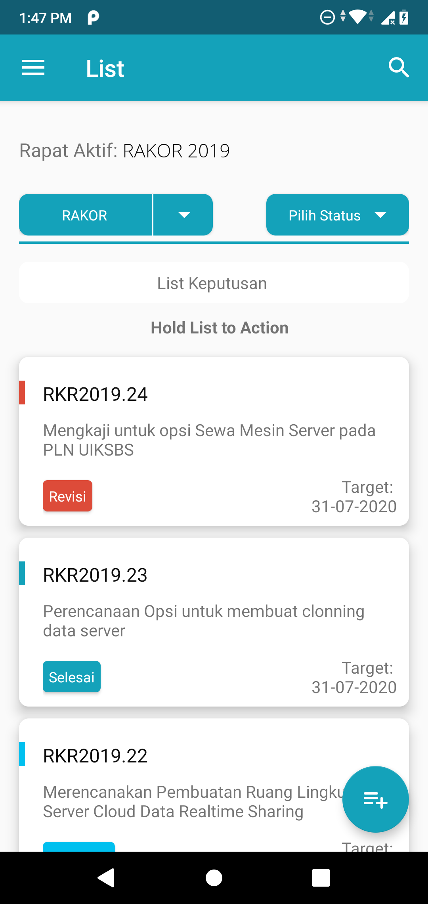
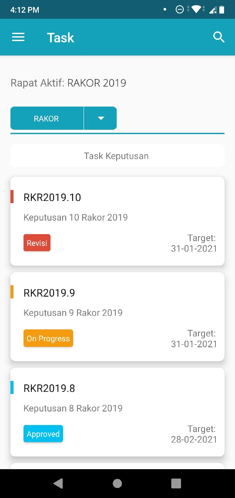
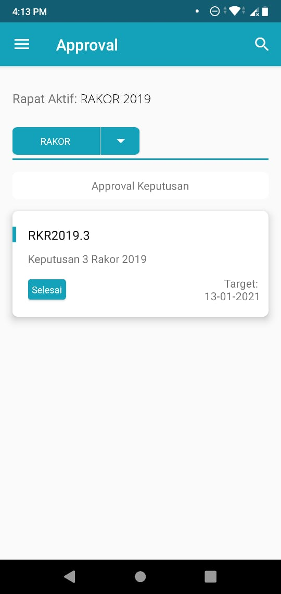
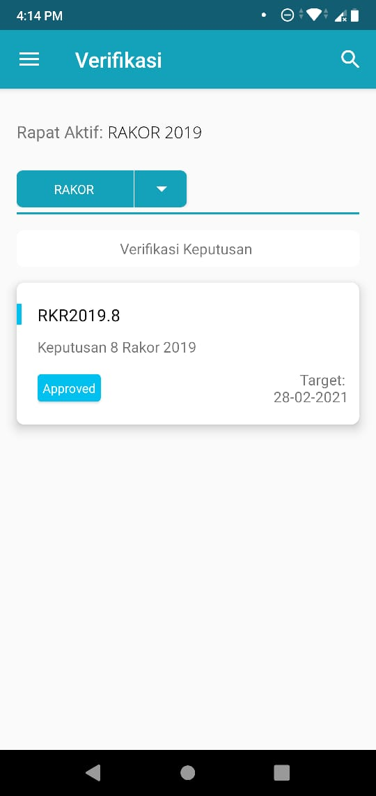
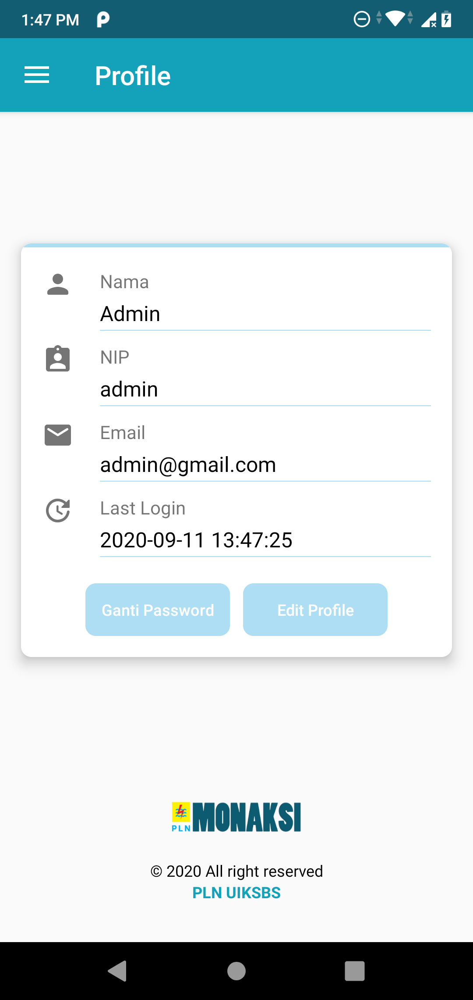

# Monaksi Android
Aplikasi Clonning Monitoring Rencana Aksi PLN UIKSBS - PLN Unit Pembangkitan Sumatera Bagian Selatan (Magang)

## Java - Android

### Gradle Used :

    implementation 'com.squareup.picasso:picasso:2.71828'
    implementation 'com.squareup.retrofit2:retrofit:2.9.0'
    implementation 'com.squareup.retrofit2:converter-gson:2.9.0'
    implementation 'de.hdodenhof:circleimageview:3.1.0'
    implementation 'com.github.thomper:sweet-alert-dialog:1.4.0'
    implementation 'org.greenrobot:eventbus:3.2.0'
    implementation 'com.github.PhilJay:MPAndroidChart:v3.1.0'
    implementation 'com.github.Ferfalk:SimpleSearchView:0.1.5'
    implementation "com.leinardi.android:speed-dial:3.1.1"

### Source Compatibility
    compileOptions {
        targetCompatibility JavaVersion.VERSION_1_8
        sourceCompatibility JavaVersion.VERSION_1_8
    }

### Change API BASE URL
    app/src/main/java/com/sabo/monaksi/Common/Common.java

### Database SQL & PHP Web Service
    https://github.com/sabo99/Monaksi/tree/master/PHP_%26_Database

## Design UI App MONAKSI

### Log In

### Menu Drawer

### Dashboard

### List Rencana Aksi

### Tambah Keputusan / Rencana Aksi
#### _Only Admin & Operator_

### Update Keputusan / Rencana Aksi
#### _Only Admin & Operator_

#

### List - Detail Keputusan / Rencana Aksi

#

### Task Rencana Aksi

#

### Task - Detail Keputusan / Rencana Aksi

#

### Task - Dialog Update Keputusan / Rencana Aksi

#

### Task - Dialog Tambah Komentar
#### Send to Approval

#

### Approval Rencana Aksi

#

### Approval - Detail Keputusan / Rencana Aksi

#

### Approval - Dialog Tambah Komentar
#### Send to Verifikator | Revisi Keputusan

#

### Verifikator Rencana Aksi

#

### Verifikator - Detail Keputusan / Rencana Aksi

#

### Profile

